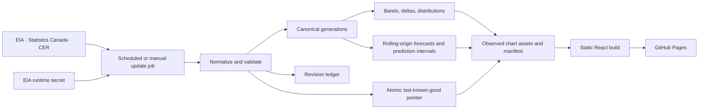

# North American Energy Market Monitor

An interactive, trader-oriented dashboard for public petroleum and energy data from the United States and Canada. The site is designed for GitHub Pages: scheduled jobs retrieve and validate source data, while the browser reads only small, secret-free static assets.

## Project status

**The USA Phase 3 and Canada observed-data dashboards are activated and verified locally.** The current promoted USA run is the provider-free rebuild `analytics-20260720T152511Z` (activation history: `eia-20260719T230756Z`). Its manifest contains all 39 active EIA definitions: the three Phase 2 USA overview series and 36 classified weekly refined-product series. USA and Canada are the two primary country pages, with `/reference/` as the educational glossary. The legacy `/products/` URL remains only as a backwards-compatible entry to the unified USA page with **Refined** selected. All active series use source-aware geography, seasonal bands, latest-value comparisons, distribution diagnostics, freshness states, revision-aware storage, and scheduled refresh/build/deploy workflows.

The activation inserted 130,964 observations, producing 161,869 canonical observations and 249 verified public chart assets. Canonical JSON is 65.09 MiB, below the 90 MiB publication guard; the activation recorded zero revisions because the refined-product observations were first insertions. Every refined-product series has latest period `2026-07-10`, and public manifest/asset verification passed. A subsequent all-active overlap attempt, `eia-20260719T231244Z`, found 7,873 unchanged rows, returned `changed: false`, created no promotion, and correctly kept `eia-20260719T230756Z` current with 249 assets.

The current promoted Canada run is `canada-20260720T192043Z`: 51 active definitions (49 Statistics Canada and 2 Canada Energy Regulator), presented as 22 **Crude** and 29 **Refined** choices. It contains 49,726 canonical observations, 404 verified observed chart assets with matching forecast records, and 21.09 MiB of canonical JSON. The merge inserted 10,184 rows, revised 0, and matched 34,946 unchanged rows. Statistics Canada reaches source month `2026-04`; CER reaches week `2026-06-16`. Forecast status is 360 ready, 18 `limited_history`, and 26 unavailable. The previous last-known-good generation was `analytics-20260720T152511Z`; the initial Canada activation was `canada-20260720T000329Z`. Public manifest and asset verification passed locally. Fifteen table 25-10-0063-01 definitions expose source-published crude grades, bitumen production and processing, equivalent products, and grade-specific refinery inputs.

The crude hierarchy is semantic and non-additive: total crude production contains net field production and synthetic crude; net field production contains light-and-medium crude, heavy crude, and non-upgraded bitumen; and non-upgraded bitumen reconciles as in-situ plus mined production **minus** crude bitumen sent for further processing. Equivalent products is a separate parent for condensate and pentanes plus. Total refinery inputs has published grade children, but the table's declared condensate-and-pentanes-plus input member currently has no observation rows and is not invented by the app. Suppressed or unavailable cells remain nonnumeric. Refinery activity sits under Crude for navigation only; this does not change provider meaning. See [Canada data](docs/canada-data.md) for the exact boundaries.

The project is published at [Aftikharmnz/USA_Canada_public_data_oil_and_gas_01](https://github.com/Aftikharmnz/USA_Canada_public_data_oil_and_gas_01), with the live site at [https://aftikharmnz.github.io/USA_Canada_public_data_oil_and_gas_01/](https://aftikharmnz.github.io/USA_Canada_public_data_oil_and_gas_01/). The initial Pages build, deployment, and public manifest checks passed. The previously exposed EIA key must still be rotated and its replacement added only as the GitHub secret `EIA_API_KEY` before automated EIA refreshes are enabled. Canada needs no provider secret.

The current observed-data boundaries are [Phase 3 refined products](docs/phase-3-refined-products.md) for the USA and [Canada data](docs/canada-data.md) for Canada. [Phase 2 USA MVP](docs/phase-2-usa-mvp.md) and [Phase 1](docs/phase-1-scope.md) remain historical boundaries. A secondary `/usa-weekly/` workspace filters the verified USA manifest to all 38 active weekly definitions for a compact fuel-distribution and midstream monitoring view; it does not create duplicate series or a separate data lineage.

An implemented, separate forecast layer now adds transparent statistical projections to the same seasonal charts — univariate baselines for every asset, plus a registered fundamental net-balance candidate (weekly barrel-accounting identity) for national distillate and jet stocks that must beat the baselines in rolling-origin selection to be published. Every weekly or monthly asset projects only the next 3 source periods, with selectable 80%, 90%, and 95% empirical **prediction intervals**. These are ranges for future observations, not confidence intervals for an estimated mean. Unavailable forecasts remain explicit, most importantly when the latest source period is nonnumeric or suppressed. Forecasts are decision support, not trading advice, and this phase does not claim machine learning or release-vintage backtesting. See [forecasting methodology and roadmap](docs/forecasting-roadmap.md).

The browser supports explicit same-level custom regional sums for registry-approved additive quantities, including PADD 1 + PADD 2 and Alberta + Saskatchewan. It recomputes seasonal bands, deltas, distributions, and latest-source status from aligned component history; it never adds derived statistics or component prediction-interval endpoints. Bottom-up combined point forecasts require every matching component forecast, and combined prediction intervals require at least 40 exact cross-region residual matches per horizon. Display-unit switching converts compatible barrel and cubic-metre scales without changing source data; thousand barrels per day is shown with the trader-facing `kb/d` abbreviation. Registered Canadian monthly flow series also offer a clearly labelled monthly-average `kb/d` view calculated with each period's actual calendar-day count. Month-end inventories and percentages remain in their valid dimensions. The sticky selection panel can be collapsed to a compact summary while scrolling.

## Active USA data

The unified `/usa/` page divides the 39 active definitions into 2 **Crude** and 37 **Refined** choices. Crude contains crude-oil production and refinery utilization; refinery activity is placed there as a navigation aid only. Refined contains total petroleum products supplied plus the 36 gasoline, distillate, and jet-fuel definitions. The `/usa-weekly/` desk excludes only the monthly crude-production definition and defaults to Refined, leaving 38 verified weekly definitions across gasoline, distillate/diesel, jet fuel, refinery utilization, and total-product implied demand.

| Series | Frequency | Finest verified published geography | Larger published views |
|---|---|---|---|
| EIA refinery utilization | Weekly | PADD | United States |
| EIA crude oil production | Monthly | 32 states plus 3 special producing areas | Five PADDs and United States |
| EIA total petroleum products supplied (implied demand) | Weekly | United States | None |

The refined segment includes 36 Phase 3 weekly definitions: 13 stocks, 8 unadjusted refinery/blender net-production series, 3 product-supplied series, 9 imports, and 3 exports. By family that is 18 gasoline, 13 distillate, and 5 jet-fuel definitions, plus the pre-existing U.S. total-petroleum-products-supplied definition. Product supplied and exports are U.S.-only; production and imports are published at PADD and U.S. levels; select stock series also reach PADD 1A/1B/1C. No weekly refined-product series is represented as city, county, refinery, or state data.

Initial freshness may be `unknown` when EIA does not provide the required per-series release timestamp and a refresh did not force an expected period; latest observation, retrieval, and last-success times remain separate.

Each country follows the same narrowing order: **Crude or Refined -> finest available geography level -> official region -> product family -> product/activity -> measure**. Geography filters every downstream choice, so unsupported products or measures never appear for the selected node. Product/activity choices place the most specific registered leaves first and broader registered parents later. The app never invents an unregistered parent or allocates a national/PADD value to a city, county, state, refinery, or other finer location.

See the exact product hierarchy, route/facet coordinates, and geography boundaries in [Phase 3 scope](docs/phase-3-refined-products.md) and [the data catalog](docs/data-catalog.md).

## Product commitments

- USA and Canada use separate routes and source registries but share chart/status patterns.
- Primary navigation is USA, Canada, and Reference; `/products/` is a legacy alias into USA Refined, not a separate primary product surface.
- Every chart shows the same Geography control, and the country dashboards resolve geography before product and measure choices.
- Choices begin at the smallest official grain verified for that series and add only valid larger source-published or computed views.
- A selected geography filters product families, products/activities, and measures downstream; a segment or geography change falls back to the first valid compatible choice.
- Registered product/activity leaves are listed before broader registered parents. This is display ordering, not permission to sum hierarchy levels.
- A geography available for one EIA series does not imply availability for another.
- City, facility, terminal, refinery, county, state, PADD, and national values are never synthesized from a broader total and presented as observed.
- Refined-product parent and child series are overlapping views, not additive categories; total gasoline, finished gasoline, blending components, CBOB/RBOB, and distillate sulfur grades are never stacked without reconciliation.
- Product supplied is labelled implied demand rather than measured consumption; total distillate is not relabelled as pure road diesel; import PADD means district of entry.
- Rollups require documented membership, compatible units/periods, complete coverage, an approved aggregation rule, and component lineage.
- Custom combinations are same-level, non-overlapping sums authorized by `config/aggregation/custom-geography.json`; unsupported series (especially utilization percentages) keep Combined disabled with a reason.
- Fixed-factor unit switching is display-only, uses the exact `1 barrel = 0.158987294928 cubic metres` conversion, and never silently crosses volume, ordinary daily-rate, calendar-day-rate, or percent dimensions. The only period-normalized exception is the registered Statistics Canada monthly-flow view: monthly volume is divided by that exact month's calendar days to derive a labelled monthly-average `kb/d`; stocks and percentages are excluded.
- Missing, suppressed, withheld, zero, and not-applicable remain distinct states.
- Every displayed asset identifies source, period, geography, unit, retrieval/freshness state, checksum, and methodology version.

The full policy is [docs/geography.md](docs/geography.md).

## Architecture



The browser never calls a credentialed provider API. EIA authentication exists only in the update process through `EIA_API_KEY`. A failed fetch, schema/facet check, geography mapping, analytic build, or deployment must leave the previous last-known-good generation intact.

See [architecture](docs/architecture.md), [data contract](docs/data-contract.md), and [the update runbook](docs/update-runbook.md).

## Repository map

```text
config/
  geographies/       Versioned geography levels, nodes, and provider codes
  series/            Exact series coordinates and per-series availability
docs/
  adr/               Architecture decision records
  phase-3-refined-products.md Current product boundary and handoff
  phase-2-usa-mvp.md Historical USA MVP boundary
  architecture.md    System boundaries and data flow
  canada-data.md     Live Canadian source and geography contract
  data-catalog.md    Active and candidate source catalog
  data-contract.md   Canonical entities and semantics
  geography.md       Geography-control and aggregation policy
  methodology.md     Observed statistics and forecast calculations
  forecasting-roadmap.md Implemented forecast profile and future research boundary
  update-runbook.md  Scheduling, retries, recovery, and freshness
pipeline/
  energy_dashboard/ Ingestion, storage, analytics, forecasting, and rebuild tooling
src/
  components/        Shared controls and interactive chart panels
  pages/             Unified USA/Canada dashboards, reference, and legacy products alias
tests/
  pipeline/          Contract, client, storage, analytics, and documentation tests
```

GitHub workflow definitions live under `.github/workflows/`; static frontend assets are served from `public/` and emitted to `dist/` by Vite.

## Local development and validation

Requirements: Node.js 24, pnpm 11, and Python 3.12 or newer.

```text
pnpm install
pnpm run dev
pnpm run check
pnpm run build
python -m unittest discover -s tests/pipeline -p "test_*.py" -v
```

From the repository root, inspect the active EIA query plan without a credential or network call:

```text
python -m pipeline.energy_dashboard.cli refresh-eia --dry-run
```

Inspect the active Canada plan the same way; this path is credential-free:

```text
python -m pipeline.energy_dashboard.cli refresh-canada --dry-run
```

After rotating the exposed key and placing only its replacement in the process environment as `EIA_API_KEY`, refresh the active registry and atomically promote verified public assets with:

```text
python -m pipeline.energy_dashboard.cli refresh-eia --store data/cache/eia --promote-to public/data/usa
```

Refresh both registered Statistics Canada tables and the CER weekly file, then atomically promote verified Canada assets with:

```text
python -m pipeline.energy_dashboard.cli refresh-canada --store data/cache/canada --promote-to public/data/canada
```

Canada refreshes preserve source status symbols, publish latest source period separately from latest numeric period, and skip generation/promotion when values, statuses, and freshness evidence are unchanged. The dedicated `refresh-canada.yml` workflow polls twice on weekdays with bounded in-client retries; failed or suspicious candidates leave the last-known-good generation in place. Scheduled freshness remains `unknown` until a reviewed expected-period calendar is implemented, and a provider release timestamp is shown only when the source supplies one.

Every changed USA or Canada refresh rebuilds the observed analytics and the matching standalone forecast records automatically. The manifest links each observed geography asset to a separate `forecast_path` with its own checksum and byte count. A build ID combines the observed and forecasting methodology versions, so the frontend can reject a mixed or stale asset set. A normal no-op source poll still creates no generation. To publish a reviewed methodology-only rebuild from the current canonical data without any provider call, use:

```text
python -m pipeline.energy_dashboard.cli rebuild-analytics --store data/cache/eia --destination public/data/usa
python -m pipeline.energy_dashboard.cli rebuild-analytics --store data/cache/canada --destination public/data/canada
```

The rebuild validates and atomically promotes a complete generation, reports `provider_network_calls: 0`, and retains the last-known-good generation on failure. Do not edit generated forecast JSON by hand.

For USA/EIA only, missing series use registry bootstrap bounds of `2014-01-01` for weekly data and `2014-01` for monthly data. Once USA history exists, routine runs automatically use 13-week weekly and 10-year monthly revision overlaps. Canada instead uses the actual registered source regimes: table 25-10-0063-01 from 2016, table 25-10-0081-01 from 2019, and a configured 2014 CER lower bound even though the source file contains older history. Both country publishers skip generation/promotion when observations and relevant metadata are unchanged and retain the current plus previous validated generation after promotion. Publication fails closed before promotion if canonical JSON exceeds 90 MiB.

For a reviewed recovery or from-scratch onboarding of exactly the 36 Phase 3 series, run from an interactive PowerShell session and enter the rotated replacement key at the masked prompt:

```powershell
.\scripts\bootstrap-phase3.ps1
```

The helper is no longer a pending activation step. It verifies the expected 36-series registry selection, uses the 2014-01-01 weekly lower bound, keeps the prompted key process-scoped, removes it afterward, and promotes only after the normal validation gates pass. Non-interactive use requires `EIA_API_KEY` in the process environment. See [the update runbook](docs/update-runbook.md) for onboarding, bounded-series/period options, separate weekly/monthly freshness checks, retention overrides, and recovery. The `plan` command is informational and is not a live refresh.

The production build emits direct `usa/`, `canada/`, `reference/`, and backwards-compatible `products/` entries. The primary navigation exposes only USA, Canada, and Reference; `products/` renders the USA page initially set to Refined. Use `VITE_BASE_PATH=/<repository-name>/` when building for a repository-scoped GitHub Pages URL.

## Documentation entry points

- New contributor or coding agent: read [CLAUDE.md](CLAUDE.md) or [AGENTS.md](AGENTS.md), this README, then the relevant country boundary.
- Current USA boundary: [docs/phase-3-refined-products.md](docs/phase-3-refined-products.md).
- Current Canada boundary: [docs/canada-data.md](docs/canada-data.md).
- Historical USA MVP boundary: [docs/phase-2-usa-mvp.md](docs/phase-2-usa-mvp.md).
- Historical foundation boundary: [docs/phase-1-scope.md](docs/phase-1-scope.md).
- Adding/changing a series: [docs/data-catalog.md](docs/data-catalog.md), [docs/data-contract.md](docs/data-contract.md), and [docs/geography.md](docs/geography.md).
- Changing calculations: [docs/methodology.md](docs/methodology.md).
- Operating updates: [docs/update-runbook.md](docs/update-runbook.md).
- Forecasting implementation, limits, glossary, and future ML roadmap: [docs/forecasting-roadmap.md](docs/forecasting-roadmap.md).

## Security

The EIA credential previously shared in conversation must be treated as exposed and rotated before live use. Store only the replacement as the GitHub Actions secret `EIA_API_KEY`, or set it in the local process environment for a local refresh.

Never place a credential in frontend code, registries, fixtures, documentation, generated assets, command arguments, logs, screenshots, or Git history. Public route templates and source URLs may be committed; credential values may not.

## Primary official references

- [EIA Open Data API v2 documentation](https://www.eia.gov/opendata/documentation.php)
- [EIA Weekly Petroleum Status Report schedule](https://www.eia.gov/petroleum/supply/weekly/schedule.php)
- [Statistics Canada Web Data Service](https://www.statcan.gc.ca/en/developers/wds)
- [Statistics Canada WDS user guide](https://www.statcan.gc.ca/en/developers/wds/user-guide)
- [CER Weekly Crude Run Summary and Data](https://www.cer-rec.gc.ca/en/data-analysis/energy-commodities/crude-oil-petroleum-products/statistics/weekly-crude-run-summary-data/index.html)
- [GitHub Pages custom workflows](https://docs.github.com/en/pages/getting-started-with-github-pages/using-custom-workflows-with-github-pages)
