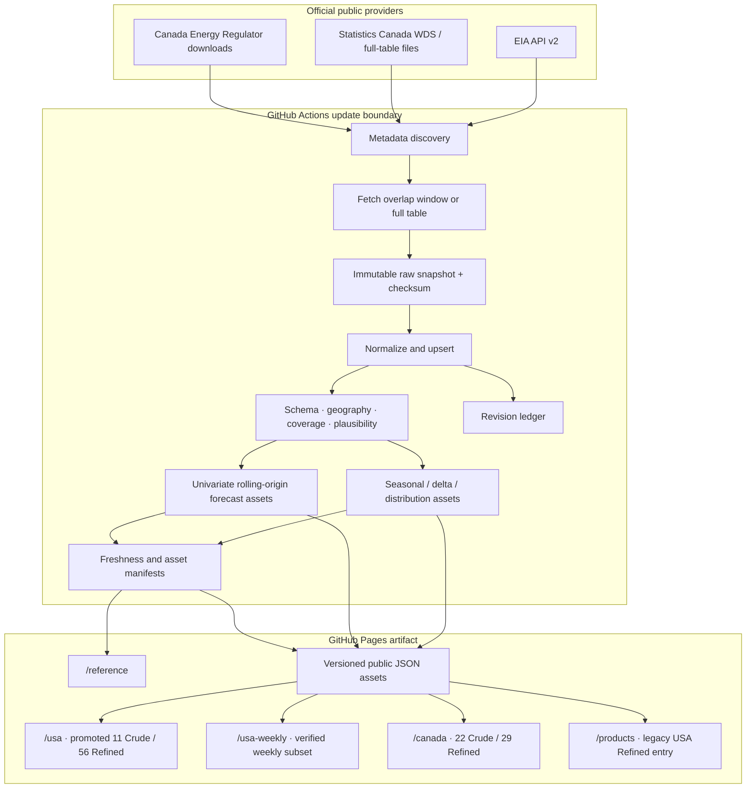

# Architecture

## Decision summary

The product is a static React/TypeScript application intended for GitHub Pages. Python code retrieves public source data, retains normalized canonical history and revisions, validates changes, computes chart-ready analytics, and publishes small static assets without exposing provider credentials to the browser.

This separation keeps credentials and source complexity out of the browser while preserving a low-cost public URL. See [ADR 0001](adr/0001-static-pages-scheduled-pipeline.md).

The current implementation covers EIA API v2, Statistics Canada full-table delivery, the CER weekly crude-runs file, strict registry/geography normalization, JSON generation storage, revision merging, observed analytics, standalone forecast assets, country manifests, unchanged-poll suppression, and scheduled same-workflow refresh/Pages deployment. Promoted USA run `eia-20260722T202149Z` contains all 67 active definitions (66 weekly and one monthly), including 28 Phase 4 additions represented by 77 exact source-series keys: 212,512 canonical observations, 326 verified observed chart assets, 326 matching forecast records, and 87,599,291 bytes (83.54 MiB) of canonical JSON. Its merge inserted 50,435 rows, revised 0, and matched 7,873 unchanged rows; forecast status is 325 ready, 1 `limited_history`, and 0 unavailable. All weekly definitions reach `2026-07-17`, monthly crude production reaches `2026-04`, and public workflow run `29954739606` deployed the matching site. Promoted Canada run `canada-20260720T192043Z` contains all 51 active definitions (49 Statistics Canada and 2 CER), classified as 22 Crude and 29 Refined, with 49,726 canonical observations, 404 verified observed chart assets and matching forecast records, and 21.09 MiB of canonical JSON. The merge inserted 10,184 rows, revised 0, and matched 34,946 unchanged rows; forecast status is 360 ready, 18 `limited_history`, and 26 unavailable. The previous Canada last-known-good generation was `analytics-20260720T152511Z`; initial activation was `canada-20260720T000329Z`. Each generated country manifest records its exact forecast readiness summary for that vintage. The verified public site is https://aftikharmnz.github.io/USA_Canada_public_data_oil_and_gas_01/; the replacement EIA secret is configured and the automated workflow has captured provider updates. Durable complete raw-body archival and release-time vintage reconstruction remain target architecture rather than current runtime claims.

The static browser additionally loads full compact period history only for the currently selected component assets. `config/aggregation/custom-geography.json` gates same-level additive combinations; the browser validates metadata/coverage, computes period sums and lineage, then recomputes chart analytics. Matching component forecasts can produce a bottom-up three-period path and newly calibrated intervals from aligned residuals. Unit conversion occurs after these canonical calculations and never changes public source assets.

## Target system boundaries

## Update lifecycle

1. **Discover metadata.** Confirm route/table identity, facets, units, frequency, and source geography values. Compare the snapshot with the committed registry.
2. **Retrieve safely.** Fetch a recent overlap window so late revisions are detected. Use a complete table when the source is small and optimized for bulk delivery.
3. **Retain evidence.** The current implementation records a deterministic source payload checksum and normalized source fields. Persisting the complete immutable response body is the next evidence-layer step; a checksum alone cannot replay the source payload.
4. **Normalize.** Convert provider identifiers into stable series, geography, units, periods, and canonical dimensions without erasing provider fields.
5. **Reconcile.** Upsert current observations and append every changed historical value to a revision ledger.
6. **Validate.** Check schema, uniqueness, missing/suppressed values, unit/frequency drift, geography availability, aggregation membership and coverage, date advancement, and plausibility.
7. **Derive.** Produce seasonality bands, deltas, distributions, chart-specific slices, and a separate matching forecast record. Weekly and monthly forecasts cover exactly the next 3 source periods, with empirical 80%/90%/95% prediction intervals.
8. **Publish atomically.** Build and deploy a complete artifact only after validation. Never expose a partially updated set.
9. **Record status.** Publish per-series and per-asset freshness, retrieval, observation, revision, and failure metadata.

## Storage layers

| Layer | Purpose | Public site? | Mutation model |
|---|---|---:|---|
| Raw snapshot metadata/files | Reproduce what the provider returned; complete body archive is outside this MVP | No | Target: append-only |
| Canonical observations | Current best-known normalized values in immutable JSON generations | Not directly | Keyed merge, generation replacement |
| Revision ledger | Previous and replacement values with detection time and payload hash | Summaries only | Append-only within generations |
| Derived chart assets | Small slices needed by the UI | Yes | Rebuilt atomically |
| Forecast assets | Separate point paths, empirical prediction intervals, model selection, and backtest diagnostics | Yes | Rebuilt atomically with matching observed assets |
| Custom aggregation registry | Finite authorization for browser-side same-level sums | Yes | Reviewed commit; versioned membership |
| Status/manifest assets | Freshness, lineage, checksums, build version | Yes | Rebuilt atomically |

The USA pipeline uses deterministic JSON for canonical observations, revisions, generation manifests, observed chart assets, and forecast assets. Parquet remains a scaling option for type fidelity and efficient large updates; it is not the current storage format. Public observed JSON is partitioned under `assets/` by series, geography, and canonical dimension hash. Its matching forecast is stored at the same relative key under `forecasts/`; the manifest records independent path/checksum/byte fields for both. Publication fails before staging promotion if canonical JSON exceeds 90 MiB.

Canada uses the same generation and public-asset contract in `data/cache/canada` and `public/data/canada`. Its 51-series active registry produces 404 verified observed chart assets with linked forecast records in current run `canada-20260720T192043Z`. Statistics Canada source symbols and missing/suppressed states remain canonical fields; freshness distinguishes the latest source period from the latest numeric period. CER national crude runs are derived only from complete same-week coverage of the three registered source regions and retain membership/component lineage. CER utilization remains regional because the source provides no explicit compatible capacity series for a defensible national ratio.

The USA registry declares missing-series bootstrap starts of 2014-01-01 for weekly and 2014-01 for monthly data. The historical Phase 3 helper remains available for scoped recovery of exactly those 36 definitions; Phase 4 uses the all-active registry refresh and normal validation path. Once a USA series exists, routine refreshes automatically overlap 13 weeks for weekly series and 10 years for monthly series unless an operator supplies an explicit range. Canada respects each registered source regime: Statistics Canada table 25-10-0063-01 begins in 2016, table 25-10-0081-01 begins in 2019, and CER uses a configured 2014 publication lower bound despite older source-file history. Identical results do not create/promote another generation by default. After successful public promotion, retention keeps the current and newest predecessor generation by default; only validated in-root generation directories are eligible for cleanup.

## Geography architecture

Geography is represented as a directed acyclic graph:

- A `GeographyLevel` describes a class such as state/area, PADD, province/territory, source refinery region, or national.
- A `GeographyNode` has stable identity, provider codes, and zero or more parents.
- `GeographyAvailability` binds a metric/series to the nodes or levels the source actually publishes and to permitted rollups.
- Membership is versioned because boundaries and source groupings can change.

The frontend always mounts one Geography control. Each country page first selects Crude or Refined, then derives the union of valid manifest geographies for that segment and orders their levels finest first. After one official node or a registered same-level set is selected, the complete selection filters the available product families, product/activity choices, measures, series, and assets. Crosswalks are not observations: they may enable an aggregation only when membership is exact and coverage passes. Full rules are in [geography.md](geography.md) and [ADR 0003](adr/0003-source-aware-geography.md).

## Frontend data contract

Each chart asset should be self-describing enough to render without hidden code tables:

- series and metric identifiers;
- unit and period semantics;
- selected geography and available geography choices;
- whether each choice is source-published, computed, or unsupported;
- component lineage for computed values;
- latest observation, prior-period and year-over-year comparisons;
- source revision information;
- seasonal and distribution payloads;
- source, retrieval, generation, and freshness fields;
- schema and asset versions.

Each observed manifest geography can additionally reference one standalone forecast record through `forecast_path`, `forecast_sha256`, and `forecast_bytes`. The forecast identifies its target, origin, training checksum, horizon, selected candidate, selection/calibration windows, point path, 80%/90%/95% empirical prediction intervals, evaluation metrics, status, and limitations. The browser requires the forecast source checksum and identity to match the loaded observed asset and the origin to match its latest numeric period. A forecast failure or mismatch removes only the projection; observed analytics remain available.

Forecast records are intentionally separate because a future projection is neither an observation nor a seasonal-band constituent. The seasonal chart renders observed paths as solid lines, forecasts as a dashed line, and a single user-selected prediction band. "Prediction interval" is the contract term; these are not confidence intervals, and nominal empirical coverage is not guaranteed. The current implementation is univariate statistical forecasting, not machine learning. Its latest-revised pseudo-out-of-sample diagnostics do not reconstruct first-release vintages, and its output is decision support rather than trading advice.

The country manifest optionally classifies a series for navigation with product family, product/component, measure, component role, parent-product ID, glossary term IDs, and display order. The primary surfaces are the unified `/usa/` and `/canada/` pages plus `/reference/`; `/products/` is a backwards-compatible wrapper that renders `/usa/` initially on Refined. `/usa-weekly/` is a secondary trader workspace over the same USA manifest and retains only verified weekly views; it never duplicates an observation, forecast, checksum, or refresh path. The promoted USA manifest resolves 11 Crude and 56 Refined definitions (66 weekly and one monthly). Canada resolves 22 Crude and 29 Refined definitions. Refinery activity is placed under Crude for navigation only. Classification never changes observation identity, provider semantics, or aggregation authority.

Both country dashboards follow the same cascade: segment -> finest available geography level -> official geography node -> product family -> product/activity -> measure. Product/activity leaves are ordered before broader registered parents. Only registered parents can appear, and the ordering is semantic navigation rather than a summation tree. A geography change recalculates all downstream choices and falls back only to a compatible manifest entry.

`/canada/` derives this cascade from the Canada manifest. Statistics Canada provincial/territorial coverage varies by coordinate; its Atlantic aggregate overlaps component provinces and is never added to them. CER source regions remain distinct from Statistics Canada geographies even when labels resemble a province, and no city/refinery/province detail is inferred. National CER utilization remains absent.

For Statistics Canada crude detail, the manifest mirrors table 25-10-0063-01 rather than creating an additive product tree. Total crude production contains net field production and synthetic crude; net field contains light-and-medium, heavy, and non-upgraded bitumen. Non-upgraded bitumen is a signed reconciliation of in-situ plus mined production minus bitumen sent for further processing. Equivalent products is a separate condensate-and-pentanes-plus parent. Total refinery inputs has available grade children, while the dimension-declared condensate-and-pentanes-plus refinery-input member has no current fact rows and is not synthesized. Suppressed and absent coordinates stay nonnumeric at every level.

Product hierarchies and inclusive stock views are directed semantic relationships, not summation trees. Total gasoline overlaps finished gasoline and blending components; conventional/reformulated overlap their finished-gasoline parent; CBOB/RBOB overlap MGBC; sulfur grades overlap total distillate. Commercial crude, SPR, and inclusive inventories are alternate overlapping views. The pipeline publishes provider values and performs no computed product rollup.

For a custom selection, the browser fetches each component asset/forecast in parallel, validates them against the committed policy, and creates an in-memory computed geography. It aggregates canonical history before recomputing bands/distributions and aggregates forecast points before recalibrating intervals from exact aligned residual sums. Failed aggregate or forecast validation cannot mutate cached/public assets and cannot hide a valid combined observed chart. Fixed-factor display units are a final rendering transform shared by cards, ECharts, tables, and distributions. The registered Canada monthly-average rate view is period-aware: after canonical regional and forecast work completes, it transforms each history or target-period value using that month's calendar-day count and rebuilds displayed analytics in memory.

## Reliability model

- Scheduled runs are polling opportunities, not proof that a release occurred.
- The pipeline confirms that the expected source period advanced before declaring success.
- The EIA client uses a bounded initial request plus 10-, 30-, and 90-second retry delays and honors numeric `Retry-After` up to 120 seconds; later workflow runs provide another recovery path.
- The scheduler includes non-round Wednesday/Thursday release-window polls and a weekday 13:37 Eastern safety/revision poll.
- The credential-free Canada scheduler polls at two non-round times each weekday, giving each source a later polling opportunity without a long-sleeping job.
- Both provider clients use bounded retry attempts; unchanged Canada values/status/freshness evidence produce a no-op, while any failed validation preserves the Canada last-known-good generation.
- Scheduled Canada freshness remains `unknown` until a reviewed expected-period calendar exists. Provider release timestamps are recorded only when the source supplies them; retrieval/check time is not relabelled as release time.
- Failed or suspicious data never overwrite the last-known-good deployment.
- Manual dispatch supports dry run, global period bounds, and forced unchanged publication; series-specific work uses the local CLI.
- Every run emits a machine-readable manifest and human-readable summary.
- A changed provider run rebuilds observed and forecast assets together. The combined build ID binds both methodology versions, preventing a mixed analytical generation.
- A source no-op produces no generation by default. `rebuild-analytics` is the provider-free path for a reviewed methodology-only rebuild from current canonical data; it uses the same validation, atomic promotion, retention, and last-known-good guarantees.

GitHub documents that scheduled workflows can be delayed or dropped under load and can be disabled in inactive public repositories. Production expectations must reflect that limitation; a later external monitor can dispatch workflows if tighter reliability is needed.

## Security model

- The browser reads only public assets.
- EIA authentication exists only inside the USA update job through `EIA_API_KEY`; Statistics Canada and CER refreshes are credential-free.
- Logs redact request parameters and never print secrets or complete credentialed URLs.
- Generated provenance stores a route template without the API key.
- Workflow permissions use least privilege; deploy jobs receive only Pages permissions.
- Dependencies and third-party actions should be pinned and reviewed.

## Scaling path

If repository size, Action runtime, release latency, or historical-vintage volume exceeds GitHub's practical limits, move raw/canonical storage and scheduled ingestion to object storage plus a managed scheduler. Keep the same static asset contract and frontend so the migration does not require a product rewrite.
