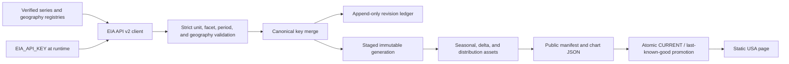

# Phase 2 USA MVP

## Status and boundary

Phase 2 activates a narrow United States petroleum dashboard backed by verified U.S. Energy Information Administration (EIA) API v2 coordinates. It adds the live-ingestion, revision-aware storage, chart-asset, and interactive-USA-page contracts needed for an end-to-end release.

This document is the historical Phase 2 boundary. [Phase 3 refined products](phase-3-refined-products.md) is the current implementation boundary, and [Phase 1](phase-1-scope.md) remains the historical foundation record.

Phase 2 includes:

- three displayed EIA series: weekly refinery utilization, monthly crude oil production, and weekly total petroleum products supplied;
- source-published geography at the smallest verified EIA grain for each selected series, followed by source-published PADD and U.S. views where available;
- a credential-safe EIA API client with deterministic pagination and bounded retries;
- canonical observation generations, an append-only revision ledger, checksums, and an atomic last-known-good pointer;
- precomputed seasonal, latest-value, and distribution assets for a static GitHub Pages frontend;
- an interactive USA page with hover values, zoom, series selection, and a Geography control on every analysis panel.

Phase 2 does not include live Canadian data, forecasting, trading signals, inferred city/county data, facility-level estimates, or a guarantee that GitHub Actions runs at an exact clock time.

## Verified local bootstrap

Phase 2's local end-to-end bootstrap completed on 2026-07-19. It has not been pushed or deployed publicly because this working directory is not an initialized usable Git repository.

| Field | Verified result |
|---|---|
| Run ID | `eia-20260719T204314Z` |
| Generated/retrieved | `2026-07-19T20:43:14.274934+00:00` |
| Canonical observations | 30,905 |
| Public chart assets | 48 plus one country manifest |
| Monthly crude production | Latest 2026-04; 41 geographies |
| Weekly products supplied | Latest 2026-07-10; U.S. only |
| Weekly refinery utilization | Latest 2026-07-10; 6 PADD/U.S. geographies |
| Revision events in bootstrap | 0 (all observations were first insertions) |
| Public/canonical freshness | `unknown` |

At Phase 2 verification, `data/cache/eia/CURRENT` pointed to generation `eia-20260719T204314Z` and the browser copy comprised `public/data/usa/manifest.json` plus 48 manifest-relative assets. That current-pointer statement is historical: [Phase 3](phase-3-refined-products.md) later promoted run `eia-20260719T230756Z`.

A second routine poll retrieved 5,059 weekly/monthly overlap rows. It returned `changed: false`, created no generation, did not move `CURRENT`, and did not repromote public assets. This verifies the no-churn polling path.

`unknown` freshness is deliberate, not an ingestion failure. EIA API v2 does not provide the per-series source release timestamp needed by this contract, and the bootstrap/workflow did not force an expected period. The UI still reports latest observation period, retrieval time, and last-success time. Local frequency-specific runs may supply `--expected-period`; workflow release-calendar derivation remains a future enhancement.

## Active EIA series

The registry at [`config/series/usa.json`](../config/series/usa.json) is the machine-readable source of truth. At Phase 2 completion, the three entries below comprised the displayed slice. The current registry uses `activation_status: active` and adds the separately documented Phase 3 definitions.

| Stable series ID | Display concept | EIA route and exact selected coordinate | Frequency / unit | Published geography offered |
|---|---|---|---|---|
| `usa.eia.refinery.utilization.weekly` | Refinery utilization | [`petroleum/pnp/wiup`](https://www.eia.gov/opendata/browser/petroleum/pnp/wiup); EIA series `W_NA_YUP_R10_PER`, `R20`, `R30`, `R40`, `R50`, and `WPULEUS3` | Weekly / percent | Five PADDs and United States |
| `usa.eia.crude.production.monthly` | Crude oil field production, including lease condensate | [`petroleum/crd/crpdn`](https://www.eia.gov/opendata/browser/petroleum/crd/crpdn); product `EPC0`, process `FPF` | Monthly / thousand barrels per day | 32 states, 3 special producing areas, five PADDs, and United States |
| `usa.eia.product_supplied.weekly` | Total petroleum products supplied (implied demand) | [`petroleum/cons/wpsup`](https://www.eia.gov/opendata/browser/petroleum/cons/wpsup); series `WRPUPUS2`, expected area `NUS`, product `EPP0`, process `VPP` | Weekly / thousand barrels per day | United States only |

"Product supplied" is an accounting measure of implied demand, not observed end-user consumption. The UI and documentation must retain that qualification.

### Supporting refinery series

`usa.eia.refinery.gross_input.weekly` and `usa.eia.refinery.operable_capacity.weekly` are registered as `verified_supporting_phase_2`. They define the compatible numerator and denominator needed for a future `ratio_of_sums` utilization rollup. They are not part of the default active refresh or displayed catalog.

The current utilization chart uses EIA's source-published percentages for each PADD and the United States. It does not average PADD percentages and does not calculate the U.S. figure from rounded regional percentages. If a computed utilization view is added later, it must divide compatible summed inputs by compatible summed capacity and retain full component lineage.

## Verified geography

The geography registry is [`config/geographies/usa.json`](../config/geographies/usa.json). Provider `duoarea` codes are mapped explicitly to stable project IDs; an unknown code fails the refresh instead of being guessed.

### Refinery utilization

- East Coast (PADD 1)
- Midwest (PADD 2)
- Gulf Coast (PADD 3)
- Rocky Mountain (PADD 4)
- West Coast (PADD 5)
- United States

City, county, state/area, and PADD-subdistrict choices are unavailable for this selected weekly utilization series.

### Crude oil production

The 32 state rows verified in the registry are Alabama, Alaska, Arizona, Arkansas, California, Colorado, Florida, Idaho, Illinois, Indiana, Kansas, Kentucky, Louisiana, Michigan, Mississippi, Missouri, Montana, Nebraska, Nevada, New Mexico, New York, North Dakota, Ohio, Oklahoma, Pennsylvania, South Dakota, Tennessee, Texas, Utah, Virginia, West Virginia, and Wyoming.

The three special producing-area rows are:

- Alaska South;
- Federal Offshore - Gulf of America;
- Federal Offshore PADD 5.

The broader source-published views are the five PADDs and the United States. Special areas can overlap concepts represented in broader official totals, so the app uses EIA-published PADD and U.S. rows rather than summing every state/area displayed in the selector.

City, county, and PADD-subdistrict observations are not published for this selected monthly series and remain unavailable.

### Total products supplied

Only the EIA-published United States row is offered. PADD, PADD-subdistrict, state/area, county, and city values are unavailable and are never allocated from the national total.

### Universal control behavior

Every chart keeps the Geography control visible, including a national-only chart. The control:

1. derives available levels and regions from the active series manifest;
2. starts at the finest verified source-published level;
3. exposes broader source-published rows only when the selected series supplies them;
4. shows unsupported levels as unavailable with a reason;
5. resets to a valid geography when a series switch makes the previous selection invalid; and
6. labels source-published versus computed origin.

No Phase 2 active asset is a computed geographic rollup.

A complete bootstrap is expected to produce 48 geography chart assets before any future dimension expansion: 6 utilization (five PADDs plus U.S.), 41 crude-production (32 states, 3 special areas, five PADDs, plus U.S.), and 1 national products-supplied asset. A different count is a review signal, not permission to silently add or drop geography codes.

## Ingestion, cache, and revision architecture

The browser never calls EIA. A refresh job reads `EIA_API_KEY` at runtime and produces secret-free static JSON.



### Retrieval and validation

- Requests are built from registry coordinates; the client does not invent petroleum facet codes.
- The EIA API key is read only from its configured environment variable.
- API v2 responses are paged at no more than 5,000 rows and sorted by deterministic identity fields.
- Authentication errors fail immediately. Connection failures, HTTP 408/425/429, and retryable 5xx responses use bounded retries; `Retry-After` is honored up to the configured cap.
- Unknown geography, unexpected unit, escaped facet, duplicate identity, malformed JSON, or a changed pagination total fails closed.
- Some EIA petroleum responses contain parallel rows in more than one unit. The registry identity includes `units`, and normalization selects only the registered unit (for crude production, `MBBL/D`). A response with no row in the expected unit fails; incompatible unit rows are not converted or mixed into the series.
- Null and symbol values remain nonnumeric status observations: null/`NA` is not available, `W` is suppressed or withheld, `-` is missing, and `--` is not applicable. None is converted to zero.

### Canonical cache and revisions

The canonical observation key is series, period, geography, and canonical dimensions. A refresh merges an overlap into the current generation:

- an unseen key is an insertion, not a revision;
- a changed value or status appends a `RevisionRecord` before the current observation is replaced;
- an identical observation is counted as unchanged;
- each revision retains old/new values and statuses, detection/retrieval times, and the source payload hash.

The first run requests full registered history. Once canonical history exists, the runner chooses a default overlap from each series' latest stored period: 13 weeks for weekly series and 10 years for monthly series. Explicit `--period-start`/`--period-end` values override that automatic window. The long monthly overlap is intentional because preliminary state production can be revised materially.

A partial weekly or monthly refresh preserves the other active series and their prior freshness in the rebuilt manifest. A partial first bootstrap is rejected because it would publish an incomplete active catalog; bootstrap all three active series before scheduling series-specific updates.

`SnapshotStore` writes a complete candidate generation under a staging directory, verifies JSON/checksums, then atomically promotes the generation and replaces the small `CURRENT` pointer. If fetch, normalization, analytics, or publication fails, the pointer is not changed and the previous generation remains the last known good dataset. By default, a retrieval with no inserted or revised values does not create a new generation or replace public assets. After a successful promotion, retention keeps `CURRENT` plus the newest validated predecessor (two generations total by default); cleanup never targets unvalidated/symlinked paths or the `CURRENT` generation.

The current implementation retains normalized canonical observations, a revision ledger, generation metadata, and source payload checksums. Persisting the complete raw EIA response body as an immutable long-term evidence layer remains a follow-up; a checksum alone is not a substitute for a raw archive.

### Public assets

The public layer contains only data required by the browser:

- a country manifest at base-aware `data/usa/manifest.json` with schema/run/freshness/source/asset metadata;
- one compact chart asset for each active series/geography/dimension combination;
- checksums and generation/methodology identifiers;
- no API key, credentialed URL, private raw payload, or internal exception text.

The frontend validates asset schema version and local asset paths, resolves them relative to the manifest/GitHub Pages base path, and accepts the enriched `series[].geographies[].asset_path` contract plus the pipeline's legacy canonical `assets[].path` form during migration. It keeps a successful asset in memory when a later fetch fails and displays a last-known-good warning. GitHub Pages deployment remains artifact-level atomic: a failed refresh/build does not replace the current public site.

## Chart and UI semantics

### Latest release

The top cards show the latest observation, the explicitly named prior-period absolute and percent change, year-over-year change against the same seasonal slot, and distance/percentile against the historical seasonal baseline. For utilization, an absolute change is expressed in percentage points; it is not a percent change.

Freshness is distinct from the observation period. The UI can show `fresh`, `due`, `late`, `stale`, `error`, or `unknown`, plus the latest period, retrieval time, known source-release time, and expected next release. An unknown provider timestamp stays unknown; retrieval time is never relabeled as release time.

### Seasonal view

- The latest year and two preceding years are overlaid by seasonal slot.
- The baseline is the ten calendar/ISO years immediately before those three display years.
- Only complete baseline years are eligible, and at least five are required.
- Each slot includes minimum, Q1, median, arithmetic mean, Q3, maximum, and sample count.
- The chart renders min-max and interquartile bands, median, an optional mean, and the three recent-year lines.
- Missing values are not zero-filled and lines do not connect across missing points.
- Hover reports the exact recent-year and band values; the legend can hide lines and the lower control supports zoom.

Monthly slots are calendar months. Weekly slots use ISO week/year derived from the retained EIA week-ending date; week 53 remains a separate slot when present.

### Distribution view

Raw levels and consecutive period-over-period changes stay visible together as responsive histogram facets on one shared count scale. Each facet shows its sample size, mean, median, sample standard deviation, interquartile range, skewness, and excess kurtosis. Gaps are excluded from the change sample.

The Phase 2 standard-library diagnostic tests only a Normal candidate, requires at least 30 usable observations, and reports its likelihood/AIC and Jarque-Bera statistic where available. It is labeled as a candidate diagnostic, not a definitive distribution classification. Student-t and other candidate families, parameter-aware goodness-of-fit p-values, Q-Q plots, and regime-aware samples remain future methodology work.

### Audit detail

Each chart asset exposes its source, source-published/computed origin, generation time, methodology version, and canonical checksum. Revision events are retained in pipeline storage; a user-facing per-observation revision-history panel is explicitly excluded from the MVP.

## Security and credential rotation

The EIA key shared in conversation must be treated as exposed. Before enabling a live scheduled refresh:

1. revoke or rotate that key through the EIA account process;
2. store only the replacement value as the GitHub Actions secret `EIA_API_KEY`;
3. set `EIA_API_KEY` only in the local process environment for a local refresh;
4. never place the value in `.env` files that could be committed, command arguments, screenshots, fixtures, logs, generated JSON, documentation, or Git history;
5. inspect refresh/build output and generated assets for credential-like strings before promotion.

Client exceptions intentionally report only a route and redact or withhold credentialed URLs. Repository configuration stores the environment-variable name, never its value.

## Scheduled refresh and same-run deployment

[`refresh-data.yml`](../.github/workflows/refresh-data.yml) is the implemented automation. Its cron entries use `timezone: America/New_York`, so these are local Eastern times across daylight-saving changes:

| Poll | Local Eastern schedule |
|---|---|
| WPSR attempt 1 | Wednesday 11:17 |
| WPSR attempt 2 | Wednesday 12:47 |
| WPSR attempt 3 | Wednesday 15:23 |
| Delayed-release retry | Thursday 11:19 |
| Safety/revision poll | Monday-Friday 13:37 |

The non-round times reduce peak scheduling pressure, but GitHub schedules remain best-effort and can be delayed, dropped, or disabled after repository inactivity.

Each live run:

1. runs all Python contract tests;
2. refreshes the active EIA catalog using the default overlaps, skip-unchanged policy, and two-generation retention;
3. on `changed: true`, verifies every manifest path/checksum/byte count and scans generated cache/public files for credential material;
4. installs locked frontend dependencies, runs frontend checks, and builds with the repository Pages base path;
5. commits only `data/cache/eia` and `public/data/usa`, then pushes;
6. uploads and deploys the same tested `dist` artifact to GitHub Pages in the same workflow.

A `GITHUB_TOKEN` commit does not start another workflow, so same-run deployment is intentional. The refresh workflow and ordinary Pages workflow share the `pages` concurrency group with cancellation disabled.

An unchanged poll exits successfully without a commit, frontend build, or deployment. A failure before commit leaves the repository and site unchanged. If a failure occurs after push but before Pages deployment, the prior Pages deployment remains live; manually rerun with `publish_unchanged: true` so the already-current canonical generation is rebuilt/deployed even if EIA is then unchanged.

Manual dispatch provides `dry_run` (required boolean, default false), optional `period_start`/`period_end` strings applied to every active series, and `publish_unchanged` (required boolean, default false). Dry run makes no network call, data write, commit, or deployment. Because period bounds apply to both weekly and monthly series, leave them blank unless the supplied EIA formats are valid for every active query; use the local CLI for frequency-specific bounded work.

## Local handoff and deployment

The dependency and validation commands currently available are:

```text
pnpm install
pnpm run check
pnpm run build
python -m unittest discover -s tests/pipeline -p "test_*.py" -v
```

Run pipeline commands from the repository root with the `pipeline.energy_dashboard` module path; no local package install or `PYTHONPATH` change is required. The current production build emits direct `usa/`, `products/`, `reference/`, and `canada/` entries and respects `VITE_BASE_PATH` for a repository-scoped GitHub Pages URL.

The runner supports a secret-free query-plan check:

```text
python -m pipeline.energy_dashboard.cli refresh-eia --dry-run
```

With a rotated key already present in the process environment as `EIA_API_KEY`, the full active-series bootstrap and atomic public promotion command is:

```text
python -m pipeline.energy_dashboard.cli refresh-eia --store data/cache/eia --promote-to public/data/usa
```

The current default refresh selects all `active` definitions, including Phase 3. Missing histories start at registered weekly/monthly bootstrap bounds; later runs automatically request a 13-week weekly overlap and a 10-year monthly overlap from each latest stored period. It publishes a new immutable generation only when values/statuses changed, switches `data/cache/eia/CURRENT`, verifies every public asset against the manifest integrity map, atomically replaces `public/data/usa`, and retains the current plus previous generation by default. See the current [Phase 3 boundary](phase-3-refined-products.md) for the activated catalog.

`--publish-unchanged` forces a new generation when a retrieval is identical; use it only for a deliberate manifest/methodology rebuild. `--retain-generations N` changes post-promotion retention and must be at least 1. The safe default `--skip-unchanged` is implicit.

For a bounded overlap, repeat `--series-id` as needed and supply `--period-start`/`--period-end`. `--expected-period` applies to every selected series in that invocation, so use it only for series with the same frequency/expected period. For example, run weekly and monthly release checks separately. A supplied expected period missing from the response produces `due`; omitting `--expected-period` produces `unknown`. A successful HTTP response alone is not evidence of a fresh release.

An already generated current store can be promoted without a network call:

```text
python -m pipeline.energy_dashboard.cli promote --store data/cache/eia --destination public/data/usa --expected-run-id <run-id> --retain-generations 2
```

The Phase 1 `plan` command remains informational and is not a live refresh. Do not hand-build or edit generated public JSON.

Public deployment handoff remains:

1. rotate/revoke the EIA credential that was exposed in conversation;
2. initialize or connect this directory to the intended GitHub repository, review the full first commit (including `data/cache/eia` and `public/data/usa`), and push the default `main` branch;
3. add only the replacement credential as repository/environment secret `EIA_API_KEY`;
4. configure repository **Settings > Pages > Build and deployment > Source** to **GitHub Actions**;
5. let the push-triggered Pages workflow build/deploy the existing verified public assets;
6. manually run the refresh workflow in `dry_run` mode, then run a live poll after checking its inputs;
7. verify `/usa/`, `/products/`, `/reference/`, and `/canada/` direct routes, the displayed run/latest/retrieval metadata, workflow schedules, and Pages environment URL.

See the operational details and failure modes in [the update runbook](update-runbook.md).

## Explicit next steps

- initialize/connect the Git repository, rotate/configure the GitHub secret, push, and enable Pages Actions deployment;
- derive expected weekly/monthly periods from reviewed release calendars so scheduled freshness can move beyond `unknown` without a manual expected-period input;
- persist immutable raw-response evidence or move it to durable object storage;
- expose revision summaries in the public manifest/UI without publishing unnecessary raw data;
- activate Canadian Statistics Canada/CER series in a separate phase;
- expand beyond the activated USA refined-product catalog only after exact coordinates, semantics, and geography are verified;
- start forecasting only after release-time vintages, leakage-safe walk-forward evaluation, and benchmark governance are approved.
