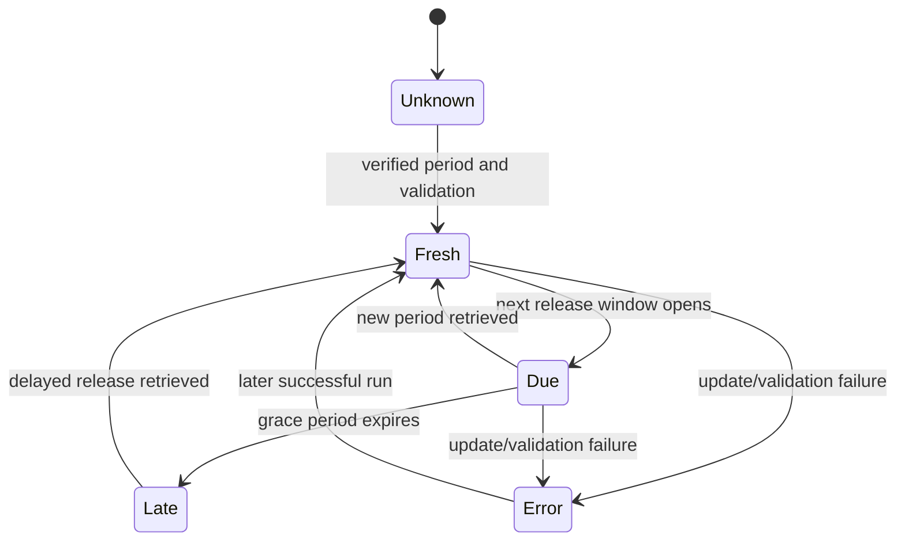

# Update and recovery runbook

## Operating objective

Automatically detect official releases, merge new and revised history, validate and derive assets, and publish atomically while retaining the last-known-good site when anything is uncertain.

## Implementation state

The credential-safe EIA client, credential-free Statistics Canada/CER clients, strict registry/geography normalization, revision-aware `SnapshotStore`, seasonal/distribution and univariate forecast asset builders, staged refresh orchestrators, `refresh-eia`, `refresh-canada`, and `rebuild-analytics` CLIs, integrity-checked atomic public promotion, and scheduled same-run Pages workflows are implemented. The active plans contain 67 USA definitions (66 weekly and one monthly) and 51 Canada definitions (49 Statistics Canada and 2 CER).

Phase 4 is activated and public in promoted USA run `eia-20260722T202149Z`. It contains all 67 active definitions, 212,512 canonical observations, 326 verified observed chart assets, 326 matching forecast records, and 87,599,291 bytes (83.54 MiB) of canonical JSON under the 90 MiB guard. The merge inserted 50,435 rows, revised 0, and matched 7,873 unchanged rows. All 66 weekly definitions reach `2026-07-17`; monthly crude production reaches `2026-04`. Public workflow run `29954739606` completed successfully and deployed the matching site.

The current local Canada refresh is `canada-20260720T192043Z` (initial activation `canada-20260720T000329Z`). It contains 49,726 canonical observations, 404 verified public chart assets, 21.09 MiB of canonical JSON, and zero revisions in the crude-detail onboarding run. Statistics Canada reaches source month `2026-04`; CER reaches week `2026-06-16`. The Canada publisher preserves source statuses and latest source period separately from latest numeric period, skips a generation when data/status/freshness evidence is unchanged, and leaves the prior generation current on any retrieval or validation failure.

The standalone forecast layer uses build ID `observed-2026-07-20.1_forecast-2026-07-20.4` and forecast methodology `2026-07-20.4`. USA run `eia-20260722T202149Z` built 326 matching observed/forecast asset pairs, while Canada refresh `canada-20260720T192043Z` built 404 pairs. The generated country `forecast_summary` is authoritative for the current vintage: USA has 325 ready, 1 limited-history, and 0 unavailable records; Canada has 360 ready, 18 limited-history, and 26 unavailable records with explicit reasons. Forecasts cover exactly 3 source periods and use latest-revised pseudo-out-of-sample diagnostics rather than first-release vintage backtests or machine learning. Ready records export aligned residual samples for strict browser-computed regional intervals. Most records are univariate statistical projections; national weekly distillate and jet stocks additionally compare a registered fundamental net-balance candidate built from the same release's flow series.

The repository is published at `Aftikharmnz/USA_Canada_public_data_oil_and_gas_01`, and the verified Pages site is https://aftikharmnz.github.io/USA_Canada_public_data_oil_and_gas_01/. CI and Pages deployment pass. The replacement `EIA_API_KEY` GitHub secret is configured, and automated EIA refresh has already captured provider updates. Canada itself needs no secret. The existing `python -m pipeline.energy_dashboard.cli plan` command remains an informational Phase 1 planner, not a live refresh.

The current generation store writes:

```text
<store-root>/
  CURRENT
  generations/<run-id>/
    canonical.json
    revisions.json
    manifest.json
    public/
      manifest.json
      assets/<series>/<geography>/<dimension-hash>.json
      forecasts/<series>/<geography>/<dimension-hash>.json
```

A candidate is written under `<store-root>/.staging/` and promoted only after normalization, analytics, manifest generation, and checksum validation complete. `CURRENT` is replaced atomically. Public directory replacement uses atomic rename where supported and a recoverable Windows fallback when directory rename semantics prevent it; either path preserves a restorable last-known-good copy. A failed run removes its staging directory and leaves the prior generation active.

The implementation records a deterministic source payload SHA-256 in refresh/revision metadata. Each forecast also records the matching observed asset checksum and is separately checksummed by the manifest. Complete immutable raw response-body retention is outside this MVP; durable archival remains required for full source replay and for true first-release vintage backtesting.

The USA registry applies bootstrap starts of 2014-01-01 to missing weekly series and 2014-01 to missing monthly series. Canada uses its registered source regimes: Statistics Canada table 25-10-0063-01 begins in 2016, table 25-10-0081-01 begins in 2019, and CER has a configured 2014 lower bound despite older rows in the source file. Canonical generation fails before promotion if `canonical.json` exceeds 90 MiB. Do not disable or raise this guard during an incident; investigate history scope, generated size, or a reviewed storage migration instead.

GitHub Actions schedules are best-effort polling triggers, not exact timers. GitHub notes that scheduled workflows can be delayed or dropped during high load, run only from the default branch, and may be disabled after inactivity in public repositories. Use non-round cron minutes, several release-window attempts, a daily safety run, and manual dispatch.

## Secrets

- Required for EIA jobs: repository or environment secret `EIA_API_KEY`.
- Use only the configured replacement key; never recover or reuse an earlier exposed value.
- Never echo the secret, a credentialed URL, request headers containing it, or an exception object that includes the full request.
- Logs and provenance store only a redacted route template.
- Statistics Canada and CER public downloads currently require no project credential; do not add secrets unnecessarily.

## Local EIA refresh and promotion

Requirements are Python 3.12 or newer and a working directory at the repository root. The canonical module invocation below does not require installing the local package or setting `PYTHONPATH`.

### Inspect the plan without a key or network

```text
python -m pipeline.energy_dashboard.cli refresh-eia --dry-run
```

The output names the exact active series, route, frequency, fields, facets, optional period window, expected period, credential environment-variable name, and number of registered EIA geography codes. It never prints a credential value.

### Refresh all active series and publish browser assets

Place only the configured replacement EIA key in the current process environment as `EIA_API_KEY`. Do not put the key in the command line or a committed `.env` file.

```text
python -m pipeline.energy_dashboard.cli refresh-eia --store data/cache/eia --promote-to public/data/usa
```

The command selects every registry entry whose activation status is `active`. A missing series automatically starts at the registry boundary for its frequency (weekly 2014-01-01; monthly 2014-01), so an all-active empty-store bootstrap is bounded. When the current generation already contains a series, the runner starts 13 weeks before its latest weekly period or 10 years before its latest monthly period. It writes and promotes a new canonical generation only after every selected series succeeds and at least one value/status was inserted or revised. It then verifies the country manifest, every referenced asset path, SHA-256, byte count, canonical size, and a credential-pattern scan before atomically replacing `public/data/usa`.

The reviewable helper below is retained for a scoped recovery or from-scratch onboarding of the Phase 3 additions. It selects exactly the 36 active entries introduced in Phase 3, asserts that count before fetching, and uses the weekly 2014-01-01 boundary. Run it in interactive PowerShell and enter the rotated replacement key at the masked prompt:

```powershell
.\scripts\bootstrap-phase3.ps1
```

The prompted key exists only in the script process and is removed afterward. Non-interactive execution requires `EIA_API_KEY` in the process environment. The helper uses the same generation validation, 90 MiB guard, promotion, and retention path as the all-active command. It is an auditable recovery/onboarding path, not a routine refresh or outstanding activation task.

An all-unchanged retrieval returns the current run ID with `changed: false`; it does not create/promote a generation. `--publish-unchanged` is the explicit escape hatch for a deliberate manifest/methodology rebuild. After a changed generation is promoted, `--retain-generations 2` is the default: keep `CURRENT` plus the newest validated predecessor. A value below 1 is rejected.

### Bounded overlap and expected-period check

Use repeatable `--series-id` values plus `--period-start` and `--period-end` to override the automatic bootstrap/overlap boundary. `--expected-period` applies to every series selected in that command. Weekly and monthly series therefore need separate expected-period runs.

```text
python -m pipeline.energy_dashboard.cli refresh-eia --series-id usa.eia.refinery.utilization.weekly --series-id usa.eia.product_supplied.weekly --period-start <YYYY-MM-DD> --expected-period <YYYY-MM-DD> --store data/cache/eia --promote-to public/data/usa
```

```text
python -m pipeline.energy_dashboard.cli refresh-eia --series-id usa.eia.crude.production.monthly --period-start <YYYY-MM> --expected-period <YYYY-MM> --store data/cache/eia --promote-to public/data/usa
```

If a supplied expected period is absent from the data, generated freshness is `due`; if no expected period is supplied, it is `unknown`. HTTP 200 alone is not sufficient. Choose overlap lengths from observed revision behavior and document any change to the operating window.

### Promote an already generated current run

```text
python -m pipeline.energy_dashboard.cli promote --store data/cache/eia --destination public/data/usa --expected-run-id <run-id> --retain-generations 2
```

`--expected-run-id` prevents an operator from promoting a different `CURRENT` generation than the one reviewed. Never copy individual generated JSON files or edit them by hand.

Promotion also prunes validated predecessor generations according to `--retain-generations` (default 2 total). Invalid, unrecognized, or symlinked directories are skipped and never become deletion targets; `CURRENT` is always retained.

After promotion, run the Python tests, `pnpm run check`, and `pnpm run build`. For repository-scoped Pages, build with `VITE_BASE_PATH=/<repository-name>/`.

## Local Canada refresh and promotion

Statistics Canada and CER require no API credential. Inspect the registered two-table/one-file plan without a network call:

```text
python -m pipeline.energy_dashboard.cli refresh-canada --dry-run
```

Refresh all 51 active Canada definitions, write the immutable generation store, verify the generated assets, and atomically promote the browser data with:

```text
python -m pipeline.energy_dashboard.cli refresh-canada --store data/cache/canada --promote-to public/data/canada --retain-generations 2
```

The command downloads each registered Statistics Canada full-table archive once and the registered CER weekly CSV, validates identity/headers/units/coordinates, and reconciles exact keys. The CER Canada crude-runs asset is built only from complete same-week coverage of Ontario, Quebec & Eastern Canada, and Western Canada; CER utilization remains regional. The command never infers a city, refinery, province, capacity, confidential cell, or national utilization value.

`--period-start`, `--period-end`, and repeatable `--series-id` values support reviewed scoped work. Use `--expected-monthly-period <YYYY-MM>` and `--expected-weekly-period <YYYY-MM-DD>` independently because Statistics Canada and CER have different frequencies. Without reviewed expected periods, scheduled freshness is `unknown`; latest source period, latest numeric period, retrieval/check time, and last success remain separately visible. A provider release timestamp can legitimately be unavailable.

An unchanged retrieval returns the current run ID with `changed: false` and does not create or promote a generation. `--publish-unchanged` is reserved for a deliberate derived-asset or manifest rebuild. On failure, do not hand-edit `data/cache/canada` or `public/data/canada`; inspect the redacted error, source metadata/status, registered coordinate, and last-known-good manifest, then rerun the same validated command after the issue is resolved.

## Provider-free analytics and forecast rebuild

A changed USA or Canada provider refresh automatically rebuilds both the observed analytics and the standalone forecast for every published manifest geography. No separate forecast scheduler is required. The publisher writes `asset_build_id`, `forecast_methodology_version`, forecast status counts, and per-geography `forecast_path`/checksum/bytes. It validates the complete observed-plus-forecast asset set before atomic promotion.

A normal source no-op still creates no generation. Use the deterministic `rebuild-analytics` command when code or methodology has changed but provider values have not, or when a reviewed recovery needs all derived assets regenerated from the current canonical generation:

```text
python -m pipeline.energy_dashboard.cli rebuild-analytics --store data/cache/eia --destination public/data/usa --retain-generations 2
python -m pipeline.energy_dashboard.cli rebuild-analytics --store data/cache/canada --destination public/data/canada --retain-generations 2
```

The command reads `CURRENT`, makes zero provider network calls, rebuilds every available observed geography asset and its forecast, verifies paths/checksums/byte counts/schema/build ID, promotes atomically, and reports `provider_network_calls: 0`. Optional `--run-id` is for a deliberate auditable identifier; otherwise the command creates an `analytics-<timestamp>` ID. Do not point the Canada command at the USA destination or vice versa, and do not copy individual files by hand.

After a rebuild, verify both manifest summaries and the forecast integrity fields, then run the Python contracts, `pnpm run check`, and `pnpm run build`. If staging, verification, or promotion fails, leave the existing public directory and last-known-good generation untouched.

The current UI calls the 80%/90%/95% ranges **prediction intervals**, not confidence intervals. The ranges have empirical nominal coverage and no guarantee. Operations must not describe the current latest-revised pseudo-out-of-sample diagnostics as first-release vintage performance, machine learning, a trading signal, or trading advice.

## Automated GitHub refresh and deployment

### First-time GitHub publication checklist

The repository is connected and Pages is configured for GitHub Actions. Complete and verify the remaining one-time data-automation steps in this order:

Current publication state: `main`, CI validation, Pages deployment, and the secret-backed EIA update workflow are operational. Phase 4 activation and all-active promotion succeeded in workflow run `29954739606`. The numbered bootstrap items below are retained as historical setup guidance.

1. **Use only the replacement EIA key.** It is already configured for GitHub Actions. For local work, keep it only in the `EIA_API_KEY` process environment. Never commit or paste it anywhere.
2. **Verify the ignore rules before the first commit.** `.gitignore` must exclude `/*.pdf` (local reference books are copyrighted and ~250 MB), `.env*`, `node_modules/`, `.pnpm-store/`, and `dist/`. `data/cache/` and `public/data/` are deliberately tracked — the refresh workflows commit them.
3. **Initialize and push:** from the project folder run `git init -b main`, `git add -A`, review `git status` for anything unexpected (especially PDFs or `.env`), then `git commit -m "initial import"`. Create the GitHub repository (public, because free-plan Pages requires it), add the remote, and `git push -u origin main`.
4. **Verify the secret if needed:** repository Settings → Secrets and variables → Actions must contain `EIA_API_KEY`; never reveal its value.
5. **Enable Pages via Actions:** Settings → Pages → Build and deployment → Source: **GitHub Actions**. The push to `main` triggers `deploy-pages.yml` for the first site build.
6. **Confirm workflow permissions:** Settings → Actions → General → Workflow permissions → **Read and write permissions**, so the refresh workflows can push data commits with `GITHUB_TOKEN`. Do not enable required branch protection that blocks the `github-actions[bot]` pusher on `main`, or the data commits will fail.
7. **First live run:** manually dispatch `Refresh EIA data and deploy` with `dry_run: true` to validate the plan, then again with defaults for a live refresh. Do the same for the Canada workflow (no secret required).
8. **Schedule caveat:** GitHub disables cron schedules after ~60 days without repository activity; the weekday data commits normally keep it active, but re-enable schedules from the Actions tab after any long pause.

Repository growth note: each changed refresh commits regenerated canonical and public JSON (tens of MB), and Git keeps every historical blob. JSON deltas compress well, but expect steady history growth; if the repository approaches GitHub's soft limits after many months, plan a reviewed history squash or move generations to release artifacts. Do not enable Git LFS for `public/data`, because GitHub Pages does not serve LFS content.

### USA / EIA workflow

The implemented workflow is [`.github/workflows/refresh-data.yml`](../.github/workflows/refresh-data.yml). It uses local Eastern cron interpretation via `timezone: America/New_York`:

| Purpose | Local Eastern time |
|---|---|
| WPSR poll | Wednesday 11:17 |
| WPSR retry | Wednesday 12:47 |
| WPSR retry | Wednesday 15:23 |
| Delayed-release retry | Thursday 11:19 |
| Weekday safety/revision poll | Monday-Friday 13:37 |

The workflow shares the `pages` concurrency group with the ordinary Pages deploy workflow and never cancels an in-progress deployment. Scheduled runs are best-effort; the timezone setting handles Eastern daylight-saving transitions, but GitHub can still delay/drop schedules or disable them after repository inactivity.

For every live poll, the workflow runs Python tests, refreshes/promotes all 67 active definitions with retention 2, and reads the CLI's `changed` result. `changed: false` exits successfully with no commit, frontend build, or deploy. On `changed: true`, the refresh has already rebuilt observed analytics and all matching forecasts with the current combined build ID. The workflow verifies both sets of public paths/assets/checksums and the 90 MiB canonical guard, scans both cache and public output for forbidden markers and the exact runtime secret, runs the locked pnpm install/check/build, commits only `data/cache/eia` and `public/data/usa`, pushes, uploads `dist`, and deploys the primary `/usa/`, `/canada/`, and `/reference/` pages, the secondary `/usa-weekly/` verified-weekly workspace, and the backwards-compatible `/products/` USA-Refined entry in the same workflow.

Same-run deployment is required because a workflow's `GITHUB_TOKEN` push intentionally does not trigger another workflow. A failure before commit leaves repository and Pages unchanged. If push succeeds but Pages deployment fails, the prior Pages artifact stays live; rerun manual dispatch with `publish_unchanged: true` to force a rebuild/deployment even when EIA has not changed again.

Manual inputs are:

- required boolean `dry_run`, default `false`: validate the plan without network, data writes, build, commit, or deploy;
- optional string `period_start` and `period_end`: passed to every active series;
- required boolean `publish_unchanged`, default `false`: force generation/deployment for recovery or an intentional derived-asset rebuild.

Because workflow period bounds apply to weekly and monthly series together, normally leave them blank. Use the local CLI with `--series-id` for a frequency-specific backfill.

The workflow does not currently derive or pass an expected period. Its manifest therefore remains `unknown` unless another reviewed process supplies that field; this is distinct from latest observation/retrieval/last-success metadata, which is populated and displayed.

### Canada workflow

The implemented Canada workflow is [`.github/workflows/refresh-canada.yml`](../.github/workflows/refresh-canada.yml). It uses `timezone: America/Toronto` and two weekday polls:

| Purpose | Local Eastern time |
|---|---|
| Primary Statistics Canada/CER poll | Monday-Friday 10:53 |
| Later retry/safety poll | Monday-Friday 14:23 |

The two independent polling opportunities complement bounded retry attempts inside the clients and avoid a job sleeping for hours. The workflow requires no provider secret. It runs all Python contracts, refreshes/promotes all 51 active definitions with retention 2, rebuilds the observed and forecast layers together when data/status/freshness evidence changes, verifies the provider set plus every observed/forecast checksum/path, scans Canada cache/public data for credential-like material, and reads the CLI's `changed` result. `changed: false` exits successfully without a commit, frontend build, or deployment. On `changed: true`, it runs the locked frontend checks/build, commits only `data/cache/canada` and `public/data/canada`, pushes, and deploys the complete Pages artifact under the shared non-cancelling `pages` concurrency group.

Canada manual inputs are `dry_run`, optional `period_start`/`period_end`, optional `expected_monthly_period`, optional `expected_weekly_period`, and `publish_unchanged`. Normally leave expected periods blank until an operator has reviewed the applicable release calendar/source state. Without them, freshness remains `unknown`; this does not erase latest source/numeric periods or last-success evidence. The workflow must not invent a source release timestamp when Statistics Canada or CER does not provide one.

As with the EIA workflow, a failure before commit leaves the repository and prior Pages artifact unchanged. If a Canada data commit succeeds but deployment fails, rerun manual dispatch with `publish_unchanged: true` so the verified current Canada generation is included in a rebuilt complete site.

## Source release strategy

### EIA weekly petroleum

- Official WPSR summary release is normally after 10:30 a.m. Eastern on Wednesday, with published holiday exceptions.
- The implemented workflow polls Wednesday at 11:17, 12:47, and 15:23 Eastern, with Thursday 11:19 and weekday 13:37 safety opportunities.
- The weekly poll covers all 66 active weekly definitions, including the 28 Phase 4 additions. A failure in any selected active definition blocks the candidate generation rather than publishing a partially updated dashboard.
- API data can trail the report. Unchanged canonical values produce `changed: false` and no deployment.
- Scheduled freshness currently remains `unknown` because no expected period/release calendar is passed. Add reviewed holiday-calendar derivation before using automated `due`/`late` claims.

### EIA monthly petroleum

- The weekday 13:37 Eastern safety poll checks monthly production revisions as well as delayed weekly data.
- Retrieve an overlap sufficient to capture revisions; monthly petroleum values can be preliminary and revised.

### Statistics Canada

- The implemented workflow polls both registered PIDs twice each weekday. Each refresh resolves the official WDS full-table URL, downloads the complete manageable archive, verifies checksum/identity/headers, and reconciles all registered keys.
- Treat a changed cube with no relevant coordinate change as a successful no-op.
- Preserve table correction notes and symbol/status metadata. The latest source month may be newer than the latest numeric month when a current cell is suppressed or unavailable; show both instead of making the older value look current.
- The current verified latest source month is `2026-04`. Do not infer a release timestamp from retrieval time when the source row does not provide one.

### CER

- Weekly observations can be delivered in batched/historical file updates. The implemented workflow downloads and validates the registered CSV twice each weekday and checks its latest observation rather than assuming a strict weekly API response.
- The dashboard/source describes confidentiality regions and voluntary coverage; preserve the note and do not infer missing refinery detail.
- The current verified latest week is `2026-06-16`. Record `unknown` freshness until a reliable expected-period rule is reviewed, and do not invent a release timestamp.

## Standard update procedure

1. Acquire a concurrency lock per provider/dataset.
2. Load registry and expected metadata fingerprint.
3. Discover source metadata; fail on unreviewed structural drift.
4. Determine expected period and whether a fetch is due.
5. Retrieve with bounded timeout, pagination, rate limiting, and a revision overlap.
6. Record retrieval metadata and raw checksum.
7. Parse while preserving provider symbols and notes.
8. Normalize series, dimensions, units, periods, and geography codes.
9. Compare with canonical keys; insert new observations and append revision events before updating changed observations.
10. Validate schema, uniqueness, period advancement, row counts, geography availability, aggregation coverage, canonical size, and plausibility.
11. Recompute affected deltas, bands, distributions, rollups, standalone forecasts, and manifests. A nonnumeric latest source period produces an explicit unavailable forecast; it is never bypassed by forecasting from an older numeric value.
12. Build the complete static artifact in isolation.
13. Run frontend/asset integrity and secret scans.
14. Deploy atomically only when all required gates pass.
15. Write run summary and update per-series `last_success_at`.

## Retry policy

The implemented EIA client uses bounded delays of 10, 30, and 90 seconds after the initial attempt for transport failures and HTTP 408, 425, 429, 500, 502, 503, and 504. It honors numeric `Retry-After` up to 120 seconds. The Statistics Canada client makes at most four attempts with 1-, 2-, and 4-second exponential delays and a 60-second request timeout. The CER client makes at most four attempts with 1-, 4-, and 16-second delays, a 30-second request timeout, and a numeric `Retry-After` cap of 60 seconds. Non-retryable HTTP failures, invalid archives/JSON/CSV, schema/facet/geography/unit drift, and validation failures are not retried blindly.

Avoid one workflow sleeping for hours. Prefer several scheduled polling opportunities, for example near the release plus later checks, and the daily safety run. A job should remain short, idempotent, and safe to rerun.

Within-job network attempts are the initial request plus the provider-specific bounded delays above. Release-window retries should occur as separate workflow runs rather than one job sleeping for hours.

## Freshness state transition



The public status shows latest observation period, provider release/update time when known, retrieval time, last successful update, next expected release, and the latest failure without exposing secrets.

## Failure handling

### Source unavailable or rate-limited

- Keep last-known-good assets.
- Mark the attempt and next retry.
- Do not change the latest observation.
- Escalate after the source-specific grace window.

### Expected period did not advance

- Keep status `due` during the grace window, then `late`.
- Confirm holiday/release announcements and source page.
- Run manual dispatch only if it adds a distinct retry opportunity.

### Schema or facet drift

- Block activation/deployment for the affected series.
- Save redacted metadata evidence and diff.
- Update registry, adapters, fixtures, tests, and docs in a reviewed change.
- Do not guess replacement fields based on similar names.

### Geography or aggregation failure

- Continue publishing a valid provider-published parent if available.
- Disable the incomplete computed view with coverage explanation.
- Inspect provider codes, membership effective date, suppressed children, duplicates, units, and period alignment.
- Never relax coverage automatically.

### Implausible value or major revision

- Compare raw source, provider notes, adjacent periods, and independent published total.
- A real official extreme is retained after review; validation must not clip it.
- If confirmed, annotate the source note/methodology where needed and rerun.

### Partial build/deploy failure

- A failure before the refresh commit leaves repository data and the existing Pages deployment unchanged.
- A failure after the bot push but before deploy leaves the previous Pages artifact live. Rerun manual dispatch with `publish_unchanged: true`; otherwise a source no-op would correctly skip the rebuild.
- Rebuild from deterministic canonical inputs; do not hand-edit generated public JSON.

### Canonical size guard

- Keep the last-known-good generation and public assets.
- Confirm that the 2014-01-01 USA weekly history boundary was applied and that duplicate dimensions/geographies were not introduced.
- Inspect manifest byte/row/asset counts and compare them with the preceding generation.
- Do not raise the 90 MiB guard as an incident workaround. Propose a reviewed partitioning/object-storage migration if valid history no longer fits.

## Manual dispatch inputs

Use the provider workflow inputs documented under **Automated GitHub refresh and deployment**. Neither workflow exposes a contract-bypass input. For USA series-specific work, use the local registry-validated CLI and then promote the reviewed generation. Canada provides separate monthly and weekly expected-period inputs because its sources have different frequencies. Manual dispatch never authorizes bypassing validation or coverage gates.

## Revision/backfill procedure

1. Run a dry retrieval for the explicit source and period range.
2. Review counts and revision magnitude.
3. Reconcile into canonical storage with ledger events.
4. Rebuild every dependent aggregate, seasonal slot, distribution, forecast, and manifest.
5. Validate published totals and UI asset compatibility.
6. Deploy and record the backfill reason/run ID.

## Routine checks

- Scheduled workflows remain enabled on the default branch.
- Latest expected periods match source pages.
- No series remains `due`, `late`, `error`, or `unknown` unexpectedly. The current initial/scheduled `unknown` state is expected until release-calendar/expected-period derivation is implemented.
- Registry metadata fingerprints still match.
- The USA manifest contains all 67 active definitions (66 weekly, one monthly), all 326 observed and 326 forecast references resolve, and the 28 Phase 4 additions reconcile to their 77 exact source-series keys.
- The Canada manifest contains all 51 active definitions (49 Statistics Canada and 2 CER) and all 404 current-run asset references resolve; future count changes require an approved registry or source-coordinate change.
- The USA forecast summary accounts for every observed asset in the promoted manifest, and every `forecast_path` checksum/byte count resolves; the current promoted evidence is 325 ready, 1 limited-history, and 0 unavailable.
- The Canada forecast summary accounts for all 404 observed assets, and unavailable records retain a reason instead of points.
- Forecast origin/checksum/identity matches its observed asset; exactly 3 weekly or monthly horizons are consecutive; each ready point contains ordered 80%/90%/95% prediction intervals backed by at least 40 calibration errors per horizon.
- The displayed wording remains prediction interval, latest-revised pseudo-out-of-sample, univariate statistical forecast, and decision support. Do not claim confidence intervals, first-release vintage performance, ML, trading signals, or trading advice.
- Canada latest-source and latest-numeric fields remain distinct where suppression/unavailability requires it; no suppressed value is coerced to zero.
- CER national crude runs, when present, have complete three-region component lineage; national CER utilization remains absent.
- Public asset size and repository history remain manageable.
- Revision volumes and row counts remain within explainable ranges.
- No generated asset contains credential-like strings.
- GitHub Pages displays the current build/run ID and status manifest.

## Escalation path

The USA refresh has no contractual SLA. If users later require guaranteed near-release availability, add an independent external monitor/scheduler that can dispatch the workflow, and consider moving ingestion/storage to managed infrastructure. Keep the public asset contract stable.
